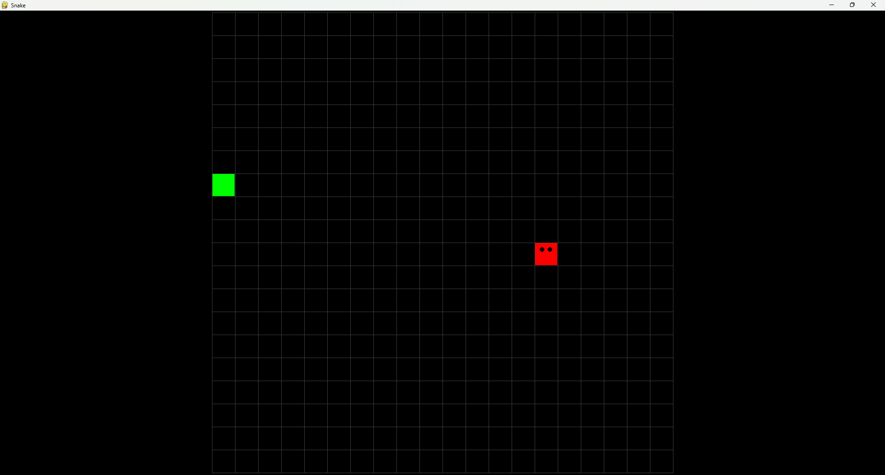

# Snake

A simple **Snake game** developed in **Python** using **Pygame** and **Tkinter**.

The player controls a snake on a **20×20 grid**, collects food to grow, and tries to achieve the highest possible score without colliding with its own body.

## Features

- Classic Snake gameplay
- 20×20 game grid
- Keyboard controls
- Random food generation
- Snake growth after eating food
- Score tracking
- Collision detection
- Game-over notification
- Ability to restart after losing
- Simple graphical interface using Pygame
- Tkinter dialogs for game notifications

## Technologies

- **Python 3.x**
- **Pygame**
- **Tkinter**

> Tkinter is included with most standard Python installations.

## Requirements

Before running the game, make sure you have:

- Python 3.x installed
- Pygame installed
- Tkinter available in your Python installation

### Install Pygame

```
pip install pygame
```

## How to Run

Clone the repository:

```
git clone https://github.com/YOUR-USERNAME/YOUR-REPOSITORY.git
```

Enter the project directory:

```
cd YOUR-REPOSITORY
```

Run the game:

```
python main.py
```

## Controls

Use the **arrow keys** or **WASD** to control the snake:

| Key | Action |
| --- | --- |
| ⬆️ Up / W | Move up |
| ⬇️ Down / S | Move down |
| ⬅️ Left / A | Move left |
| ➡️ Right / D | Move right |

## Project Structure

The project is organized using classes and helper functions to manage:

- The snake and its individual segments
- Snake movement
- Keyboard and game events
- Game rendering
- Game grid creation
- Random food generation
- Collision detection
- Score management
- Game-over dialogs
- Game restart functionality

## Screenshot

